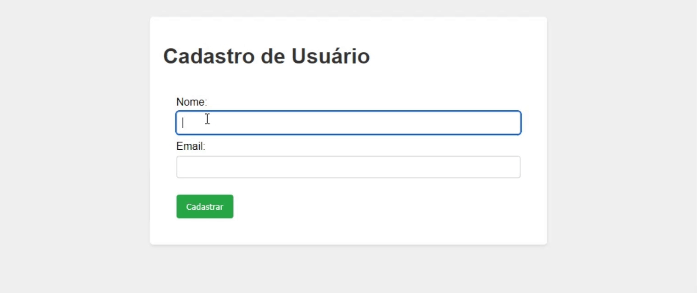

<table style="width: 100%; margin: 0 auto;">
<thead>
    <tr>
        <td rowspan="2"></td>
        <td colspan="2" align="center"><b>INSTITUTO FEDERAL DO CEARÁ - CAMPUS TAUÁ<br>
                        ANÁLISE E DESENVOLVIMENTO DE SISTEMAS</b>
        </td>
    </tr>
    <tr>
        <td><b>Professor:</b> Me. Lucas Mendes</td>
        <td><b>Disciplina:</b> Programação Web I<br>
            <b>Turma:</b> S3
        </td>
    </tr>
    <tr>
        <td colspan="3" align="center"><strong>Atividade Prática: Cadastro e listagem de usuários com organização MVC mínima</strong></td>
    </tr>
</thead>
<tbody>
    <tr>
        <td colspan="3"><b>Instruções:</b></td>
    </tr>
    <tr>
        <td colspan="3">- A prática deve ser resolvida em Java, utilizando os fundamentos da linguagem, de Servlets, JSPs e Padrão MVC.</td>
    </tr>
    <tr>
        <td colspan="3">- A entrega deve ser feita anexando o link do repositório no Classroom. Pode ser utilizado o mesmo repositório geral para a disciplina, caso tenha criado. Nesse caso, utilize uma estrutura de pastas adequada para separar a atividade e envie o link onde encontra-se a pasta desta atividade dentro do repositório.</td>
    </tr>
    <tr>
        <td colspan="3">- O uso de ferramentas de IA deve ser feito com responsabilidade e seguindo o <a href="https://docs.google.com/document/d/1eUUiuaxLibc84h4bAZb6qX0cdZKHAm4akP9JXBxiP-s/edit?usp=sharing" target="_blank">código de conduta da disciplina</a>. Adicione uma seção de Declaração de Uso de IA, caso tenha utilizado, em um arquivo README.md na raiz do projeto.</td>
    </tr>
</tbody>
</table>

---

## 📌 Descrição da Atividade

Nesta atividade, você irá desenvolver um sistema web simples para cadastro e listagem de usuários, utilizando Java, Servlets, JSPs e seguindo uma organização mínimamente aderente ao padrão MVC (Model-View-Controller). O objetivo é aplicar os conceitos aprendidos em aula para criar uma aplicação funcional que permita aos usuários se cadastrarem e visualizarem a lista de usuários cadastrados, organizada de modo a separar as responsabilidades entre os componentes de apresentação e de lógica de negócio.

> [!NOTE]
> - Esta atividade é uma oportunidade para praticar a implementação de um sistema web utilizando Java e os conceitos de MVC, além de reforçar as boas práticas de codificação e organização de projetos.
> - Ainda vamos nos aprofundar em assuntos relacionados a arquitetura e padrões para sistemas web, onde vamos entender que o padrão MVC passou por diversas evoluções e adaptações, dando origem a outros padrões como MVP, MVVM, etc. Mas para esta atividade, o foco é implementar uma organização mínima seguindo as práticas mais comuns em frameworks web modernos para desenvolvimento backend.

## ▶️ Requisitos Funcionais

1. **RF01 - Cadastro de Usuário**: O sistema deve permitir que os usuários se cadastrem fornecendo informações como nome e email. Os dados devem ser validados para garantir que não sejam vazios e que o email seja único. Um ID único deve ser gerado para cada usuário cadastrado.
2. **RF02 - Listagem de Usuários**: O sistema deve exibir uma lista de todos os usuários cadastrados, mostrando suas informações (nome e email).

## 🛠️ Requisitos Não Funcionais

1. **RNF01 - Persistência de Dados**: Os dados dos usuários devem ser armazenados em memória (utilizando uma estrutura de dados como ArrayList) durante a execução da aplicação. Não é necessário implementar persistência em banco de dados para esta atividade.
2. **RNF02 - Organização MVC**: A aplicação deve ser organizada seguindo o padrão MVC, com uma clara separação entre as camadas de Model (representação dos dados), View (interface do usuário) e Controller (lógica de controle).
3. **RNF03 - Validação de Dados**: O sistema deve validar os dados de entrada para garantir que o nome e email não sejam vazios e que o email seja único.
    > **Regras de validação**:
    > - Em caso de falha na validação, o sistema deve exibir mensagens de erro apropriadas para o usuário. Você pode implementar um HTML de retorno com o erro, encaminhar para uma JSP de erro, ou exibir a mensagem de erro na mesma página do formulário de cadastro (que, neste caso, precisar ser uma JSP). 
    > - Retorne um `status code` HTTP adequado para cada tipo de resposta. Consulte a seguinte documentação para entender melhor como trabalhar com códigos de status HTTP em Servlets: [HTTP Status Codes](https://tomcat.apache.org/tomcat-11.0-doc/servletapi/jakarta/servlet/http/HttpServletResponse.html).
4. **RNF04 - Uso de Servlets e JSPs**: A aplicação deve utilizar Servlets para a lógica de controle e JSPs para a apresentação da interface do usuário. Os Servlets devem ser responsáveis por processar as requisições, interagir com o modelo de dados e encaminhar as respostas para as JSPs adequadas.
5. **RNF05 - JSPs Limpas**: As páginas JSP devem ser organizadas de forma limpa e manutenível, separando o código HTML do código Java, utilizando EL e JSTL, por exemplo. Evite o uso de scriptlets em JSPs, bem como executar lógica de negócio dentro das páginas.

## 🛠️ Estrutura Sugerida do Projeto

```
├── src/java
│   ├── model
│   │   └── Usuario.java
│   ├── service
│   │   └── UsuarioService.java
│   ├── servlets
│   │   ├── UsuarioServlet.java
├── src/webapp
│   ├── index.html/jsp (formulário de cadastro)
|   ├── listar.jsp
|   └── erro.jsp (opcional, para exibir mensagens de erro)
├── README.md
```

## ℹ️ Dicas para Implementação

- Use a estrutura e código base fornecidos em aula como ponto de partida para a implementação.

    - O código base do exemplo desenvolvido em aula, está na pasta [exemplos/exemplo_mvc](./../exemplos/exemplo_mvc/).
    - Utilize-o como referência para a realização desta atividade.

- Certifique-se de seguir as boas práticas de codificação, como nomeação clara de variáveis e métodos, organização do código e comentários explicativos quando necessário.

    - **Regras e boas práticas de codificação**: 
        - Siga as convenções de codificação Java, como nomeação de classes em `PascalCase`, métodos e variáveis em `camelCase`, e mantenha o código limpo e organizado. 
        - Evite código duplicado e utilize comentários para explicar partes mais complexas do código.

## 🎯 Exemplo de UI

Abaixo está um exemplo de como a aplicação pode ser apresentada, a nível de interface do usuário, utilizando JSPs para o formulário de cadastro e a listagem de usuários. Lembre-se de que a implementação pode variar, e o foco principal é atender aos requisitos funcionais e não funcionais estabelecidos.

