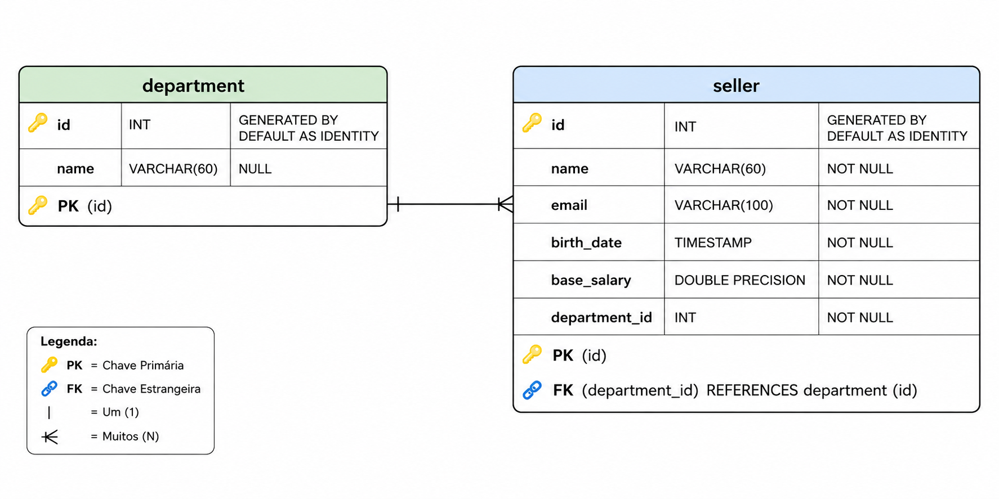
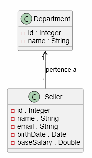
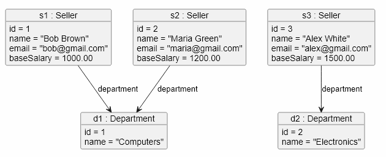
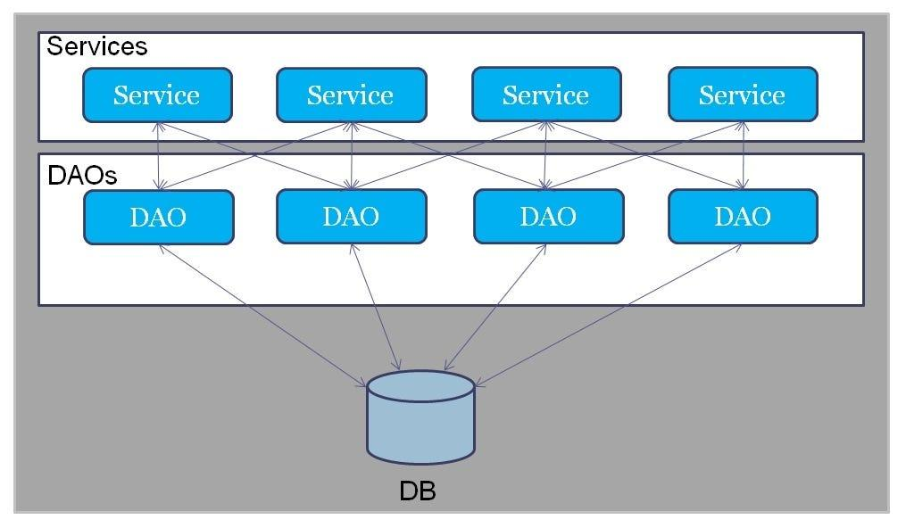
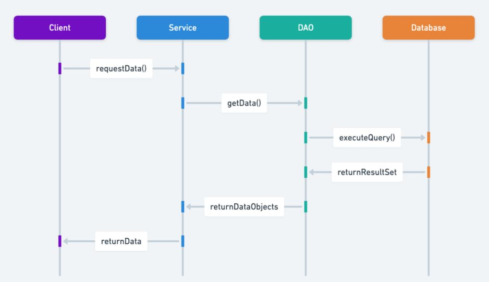

# Roteiro de Prática — Integração com Banco de Dados via JDBC API

> **Contexto:** este roteiro guiará você no desenvolvimento de uma aplicação que utiliza a API JDBC para interagir com um banco de dados PostgreSQL.

---

## 🎯 Objetivo

Ao final desta prática, você terá desenvolvido uma aplicação funcional que demonstra a integração com um banco de dados relacional utilizando JDBC, além de ter aplicado boas práticas de desenvolvimento, como o uso dos padrões de projeto como _Creation Method_ e _Data Access Object_ (DAO).

---

## 📚 Material de Apoio e Referências

- Slides da disciplina sobre JDBC: [pweb1-slide-05-jdbc-dao.pdf](./../../materiais/slides/pweb1-slide-05-jdbc-dao.pdf)
- Livro `Java: Como Programar` (Deitel & Deitel) - Capítulo 24. Disponível na BVU: https://plataforma.bvirtual.com.br/Acervo/Publicacao/39590
- Livro `Explorando APIs e bibliotecas Java` - Capítulo 4. Disponível na BVU: https://plataforma.bvirtual.com.br/Acervo/Publicacao/212825
- Revisão de OO e SQL com Java e JDBC: [Canal DevSuperior](https://youtu.be/xC_yKw3MYX4?si=O7kgpoWw3ecHoiBJ)

> [!NOTE]
> Recomendo fortemente que vocês revisem pelo menos os conceitos básicos de Orientação a Objetos e SQL. O vídeo do canal DevSuperior, que deixei acima, oferece uma ótima revisão. Se precisar rever esses conceitos, esse é o momento!

---

## 📌 Instruções para Realização e Entrega da Atividade

- Siga as etapas descritas neste roteiro para desenvolver a aplicação, implementando as funcionalidades de CRUD para as entidades `Seller` e `Department`, tentando entender os conceitos e abordagens práticas utilizadas.
- Em alguns pontos do roteiro, você encontrará seções marcadas como **📌 Agora é com você!**. Nesses momentos, é esperado que você implemente a funcionalidade por conta própria, utilizando os conhecimentos adquiridos durante as aulas e com os materiais de apoio.
- O projeto deve ser entregue em um repositório público no GitHub.
- Utilize commits frequentes e mensagens de commit descritivas para documentar o progresso do desenvolvimento. Siga o padrão `conventional commits` para facilitar a leitura do histórico. Exemplos:
  - `✨ feat: adiciona entidades de domínio da aplicação`
  - `🐛 fix: resolve problema de conexão com o Banco de Dados ao corrigir URL de conexão`
  - `📚 docs: atualiza README com descrição do projeto`
- Sua entrega deve conter uma classe de teste (pode ser a classe `Main`) onde você demonstra o funcionamento das operações de CRUD para as entidades `Seller` e `Department`, utilizando os DAOs implementados. **_Vou utilizar essa classe de teste para avaliar a funcionalidade da aplicação, então certifique-se de que ela esteja completa e funcional._**

> [!NOTE]
> Caso tenha dificuldade em relação à gestão básica de repositórios usando Git e GitHub, dê uma olhada nos materiais abaixo:
>
> - Slide da disciplina sobre Git: [pweb1-slide-02-git-intro.pdf](./../../materiais/slides/pweb1-slide-02-git-intro.pdf)
> - Git e GitHub Tutorial Completo: [Canal DevSuperior](https://www.youtube.com/watch?v=_hZf1teRFNg)
>
> Sobre padrão de mensagens de commits e conventional commits, acesse o seguinte repositório no GitHub: https://github.com/iuricode/padroes-de-commits

---

## 📌 Pré-requisitos

Para realizar esta prática, você precisará ter os seguintes softwares instalados em sua máquina:

- Java JDK 21 (https://www.oracle.com/java/technologies/downloads/).
- Maven 3.9 (https://maven.apache.org/download.cgi).
- PostgreSQL 18 (https://www.postgresql.org/download/).
  - Ao instalar o PostgreSQL, certifique-se de definir a senha do usuário `postgres`, pois ela será necessária para configurar a conexão com o banco de dados.
  - Além disso, vamos usar o `pgAdmin` para gerenciar o banco de dados, que é instalado junto com o PostgreSQL.

> [!NOTE]
> As versões mencionadas acima são as que foram utilizadas para o desenvolvimento desta prática. Caso você utilize versões diferentes, é possível que ocorram problemas de compatibilidade.

---

## 📚 Especificação do Projeto

Deseja-se construir uma aplicação que gerencie as informações de vendedores e departamentos de uma loja. A aplicação deve permitir a inserção, atualização, exclusão e consulta de registros no banco de dados (CRUD básico).

Abaixo está o diagrama ER simplificado que representa o modelo de dados da aplicação:



- **Relacionamento entre Vendedor e Departamento:**
  - Cada vendedor pertence a um único departamento, enquanto cada departamento pode ter vários vendedores. A relação é de **muitos para um (n:1)**.
  - O campo `department_id` na tabela `seller` é uma **chave estrangeira** que referencia a tabela `department`.

A nível de modelagem de domínio da aplicação, teremos duas entidades principais: `Seller` e `Department`.

O diagrama de classes a seguir ilustra a estrutura das classes de domínio (entidades), bem como a associação entre elas:



O diagrama de objetos abaixo mostra um exemplo de como as instâncias das classes `Seller` e `Department`, em memória, podem se relacionar em tempo de execução:



### ✅ Funcionalidades da Aplicação

**CRUD de Vendedores e Departamentos:**

- **Inserir Vendedor:** Permite adicionar um novo vendedor ao banco de dados, associando-o a um departamento existente.
- **Atualizar Vendedor:** Permite modificar os dados de um vendedor existente, incluindo a possibilidade de alterar o departamento ao qual ele pertence.
- **Excluir Vendedor:** Permite remover um vendedor do banco de dados.
- **Consultar Vendedor:** Permite visualizar os dados de um vendedor específico ou listar todos os vendedores cadastrados.
- **Inserir Departamento:** Permite adicionar um novo departamento ao banco de dados.
- **Consultar Departamento:** Permite visualizar os dados de um departamento específico ou listar todos os departamentos cadastrados.
- **Atualizar Departamento:** Permite modificar os dados de um departamento existente.
- **Excluir Departamento:** Permite remover um departamento do banco de dados, desde que não haja vendedores associados a ele.

---

## 1️⃣ Parte 1 - Configuração do Projeto e Conexão com o Banco de Dados

### 1.1 Configuração do Banco de Dados

1. Instale o PostgreSQL e o pgAdmin, se ainda não tiver feito isso.

2. Abra o `pgAdmin` e crie o banco de dados `loja_jdbc`.

3. Na `Query Tool` do banco `loja_jdbc`, execute o script SQL disponível no seguinte gist: https://gist.github.com/lucas-lfm/cac01a20bd407271ac2b914276e26b65

- Este script criará as tabelas `department` e `seller`, além de inserir alguns dados de exemplo para teste.

### 1.2 Configuração do Projeto

1. Crie um novo projeto Java, com Maven (sem nenhum archetype), e adicione a dependência do driver JDBC para o SGBD PostgreSQL no arquivo `pom.xml`:

```xml
<dependencies>
    <!-- Dependência do driver JDBC para PostgreSQL -->
    <dependency>
        <groupId>org.postgresql</groupId>
        <artifactId>postgresql</artifactId>
        <version>42.7.11</version>
    </dependency>
</dependencies>
```

2. Ainda no arquivo `pom.xml`, altere a versão do plugin `maven-compiler-plugin` para garantir que o projeto seja compilado com a versão 21 do Java.

3. No arquivo `src/main/java/Main.java`, teste a conexão com o banco de dados utilizando a classe `DriverManager` e imprima uma mensagem de sucesso ou erro:

```java
import java.sql.Connection;
import java.sql.DriverManager;
import java.sql.SQLException;

public class Main {
    public static void main(String[] args) {
        String url = "jdbc:postgresql://localhost:5432/loja_jdbc";
        String usuario = "postgres";
        String senha = "123456";

        try (Connection conn = DriverManager.getConnection(url, usuario, senha)) {
            System.out.println("Conectado com sucesso!");
        } catch (SQLException e) {
            System.err.println("Erro ao conectar ao banco de dados:");
            e.printStackTrace();
        }
    }
}
```

> [!TIP]
> No código acima, utilizamos o `try-with-resources`, do Java, para garantir que a conexão seja fechada automaticamente após o uso, mesmo que ocorra uma exceção. Saiba mais sobre esse recurso em https://www.baeldung.com/java-try-with-resources.

> [!NOTE]
> Certifique-se de substituir a senha pelo valor correto que você definiu durante a instalação do PostgreSQL.

4. Execute a classe `Main` para verificar se a conexão com o banco de dados foi estabelecida com sucesso. Se tudo estiver configurado corretamente, você verá a mensagem `"Conectado com sucesso!"` no console. Caso contrário, a mensagem de erro será exibida, e você poderá usar as informações do stack trace para diagnosticar o problema.

---

## 2️⃣ Parte 2 - Implementação das Classes de Domínio

Nesta etapa, você deve implementar as classes de domínio `Seller` e `Department`, seguindo a estrutura apresentada no diagrama de classes. Certifique-se de incluir os atributos, construtores, getters e setters para cada classe.

### 2.1 Classe `Department`

1. Crie um pacote chamado `entities` para organizar as classes de domínio da aplicação.

2. Dentro do pacote `entities`, implemente a classe `Department` com os seguintes atributos:

```java
public class Department {
    private Integer id;
    private String name;

    // Construtores, getters e setters
}
```

> [!NOTE]
> Crie um construtor com todos os atributos e outro construtor vazio para facilitar a criação de objetos.

### 2.2 Classe `Seller`

1. Implemente a classe `Seller`, no pacote `entities`, com os seguintes atributos:

```java
import java.time.LocalDate;

public class Seller {
    private Integer id;
    private String name;
    private String email;
    private LocalDate birthDate;
    private Double baseSalary;
    private Department department;

    // Construtores, getters e setters
}
```

> [!NOTE]
>
> - Assim como na classe `Department`, crie um construtor com todos os atributos e outro construtor vazio para facilitar a criação de objetos.
> - O atributo `department` é do tipo `Department`, representando a associação entre as duas entidades. Certifique-se de incluir os getters e setters para esse atributo, permitindo que você possa associar um vendedor a um departamento específico.
> - Para o atributo `birthDate`, utilize a classe `LocalDate` do pacote `java.time`, que é a forma recomendada de representar datas no Java moderno. Certifique-se de importar a classe corretamente.

### 2.3 Testando as Classes de Domínio

Após implementar as classes de domínio, teste-as na classe Main para garantir que os objetos possam ser criados e manipulados corretamente. Por exemplo:

```java
public class Main {
    public static void main(String[] args) {
        Department d1 = new Department(1, "Vendas");
        Seller s1 = new Seller(1, "João Silva", "joao.silva@email.com", LocalDate.of(1990, 5, 15), 5000.0, d1);

        System.out.println("Departamento: " + s1.getDepartment().getName());
        System.out.printf("Vendedor: %s, Email: %s%n \nData de Nascimento: %s, Salário Base: %.2f \n", s1.getName(), s1.getEmail(), s1.getBirthDate(), s1.getBaseSalary());
    }
}
```

> [!NOTE]
> No exemplo acima, criamos um departamento e um vendedor associado a esse departamento. Em seguida, imprimimos as informações do vendedor, incluindo o nome do departamento ao qual ele pertence. Certifique-se de que os getters e setters estejam funcionando corretamente para acessar os atributos dos objetos.

---

## 3️⃣ Parte 3 - Factory Method e Padrão DAO para Acesso ao Banco de Dados

### 3.1 Introdução ao Padrão DAO (Teoria)

Nesta etapa, você irá implementar o padrão de projeto DAO (_Data Access Object_) para gerenciar as operações de acesso ao banco de dados para as entidades `Seller` e `Department`. O padrão DAO ajuda a separar a lógica de acesso a dados da lógica de negócios, promovendo uma arquitetura mais limpa e modular.



O problema que o padrão DAO resolve é a **complexidade e acoplamento** que pode surgir quando a lógica de acesso a dados é **misturada com a lógica de negócios e espalhada ao longo do código**.

Ao utilizar o padrão DAO, você pode isolar as operações de banco de dados em classes específicas, facilitando a manutenção e evolução do código. Isso cria uma camada de abstração entre a aplicação e o banco de dados, permitindo que classes de serviço acessem os dados de forma consistente.



Esse padrão é geralmente composto por três componentes principais:

- **DAO Interface:** Define os métodos de acesso a dados que serão implementados pelas classes concretas. Por exemplo, `SellerDAO` e `DepartmentDAO` podem ter métodos como `insert`, `update`, `delete`, `findById`, e `findAll`.
- **DAO Implementation:** Implementa a interface DAO, contendo a lógica específica para interagir com o banco de dados usando JDBC. Por exemplo, `SellerDAOImpl` e `DepartmentDAOImpl` conterão as implementações dos métodos definidos na interface, utilizando `PreparedStatement` para executar as operações SQL.
- **Factory Class:** Uma classe de fábrica, como `DAOFactory`, é responsável por criar as instâncias dos DAOs. Isso permite que a aplicação seja flexível e possa ser facilmente adaptada para usar diferentes implementações de DAOs, se necessário.

> [!TIP]
> Veja mais sobre o padrão DAO em https://www.baeldung.com/java-dao-pattern.

### 3.2 Fábrica de Conexões - Creation Method (Teoria)

Antes de implementar os DAOs, é importante criar uma classe de fábrica para gerenciar as conexões com o banco de dados. Isso ajuda a centralizar a lógica de criação de conexões e facilita a reutilização do código.

Nesse contexto, _Creation Method_ é um termo utilizado para definir uma abordagem onde a lógica de criação de objetos é encapsulada em métodos específicos, geralmente em uma classe de **fábrica**.

Nesta prática, teremos uma **fábrica de conexões**, sendo uma classe responsável por criar e gerenciar as conexões com o banco de dados. Nela, vamos centralizar a lógica de configuração e criação de conexões, facilitando a manutenção e reutilização do código.

> [!TIP]
>
> - Veja mais sobre o padrão Creation Method em https://refactoring.guru/pt-br/design-patterns/factory-comparison.

### 3.3 Criando uma Fábrica de Conexões

1. Crie um pacote chamado `db` para organizar as classes relacionadas à configuração do banco de dados.

2. Dentro do pacote `db`, crie a classe `ConnectionFactory` com um método estático para obter uma conexão com o banco de dados:

```java
import java.sql.Connection;
import java.sql.DriverManager;

public class ConnectionFactory {
    private static final String URL = "jdbc:postgresql://localhost:5432/loja_jdbc";
    private static final String USER = "postgres";
    private static final String PASSWORD = "123456";

    public static Connection getConnection() {
        try {
            return DriverManager.getConnection(URL, USER, PASSWORD);
        } catch (Exception e) {
            throw new RuntimeException("Erro ao obter conexão com o banco de dados", e);
        }
    }
}
```

> [!TIP]
> Sempre que for necessário obter uma conexão com o banco de dados, você pode chamar o método `ConnectionFactory.getConnection()`, que irá retornar uma nova conexão configurada com os parâmetros definidos na classe.

### 3.4 Implementação do DAO para `Department`

1. Crie um pacote chamado `dao` para organizar as classes relacionadas ao acesso a dados.

2. Dentro do pacote `dao`, crie a interface `DepartmentDAO` com os seguintes métodos:

```java
import java.util.List;
import com.example.entities.Department; // Certifique-se de importar a classe Department corretamente

public interface DepartmentDAO {
    void insert(Department department);
    void update(Department department);
    void deleteById(Integer id);
    Department findById(Integer id);
    List<Department> findAll();
}
```

> [!TIP]
> A interface `DepartmentDAO` define os métodos que serão implementados para realizar operações de acesso a dados relacionadas aos departamentos. Ela define um contrato que as classes de implementação devem seguir, garantindo uma estrutura consistente e padronizada para o acesso a dados.

3. Crie uma classe chamada `DepartmentDAOImpl`, que implementa a interface `DepartmentDAO`, utilizando JDBC para interagir com o banco de dados.

```java
import java.sql.*;
import java.util.List;
import java.util.ArrayList;
import com.example.entities.Department; // Certifique-se de importar a classe Department corretamente

public class DepartmentDAOImpl implements DepartmentDAO {
    private Connection conn;

    public DepartmentDAOImpl(Connection conn) {
        this.conn = conn;
    }

    @Override
    public List<Department> findAll() {
        List<Department> departments = new ArrayList<>(); // Lista para armazenar os departamentos encontrados

        try (Statement stmt = conn.createStatement();
             ResultSet rs = stmt.executeQuery("SELECT * FROM department")) {

            // next() avança para o próximo registro e retorna true enquanto houver registros para ler no ResultSet
            while (rs.next()) {
                // Cria um novo objeto Department para cada registro encontrado
                Department department = new Department();
                department.setId(rs.getInt("id"));
                department.setName(rs.getString("name"));

                // Adiciona o departamento encontrado à lista
                departments.add(department);
            }
        } catch (SQLException e) {
            System.err.println("Erro ao listar departamentos:");
            e.printStackTrace();
        }

        return departments; // Retorna a lista de departamentos encontrados
    }

    @Override
    public Department findById(Integer id) {
        // Implementação do método para encontrar um departamento por ID no banco de dados
        return null; // Retorne o departamento encontrado ou null se não encontrado
    }

    @Override
    public void insert(Department department) {

        try (PreparedStatement pstmt = conn.prepareStatement("INSERT INTO department (name) VALUES (?)")) {
            // Define o valor do parâmetro para o nome do departamento
            // O 1 indica a posição do parâmetro na consulta SQL (o primeiro '?')
            pstmt.setString(1, department.getName());

            // Executa a consulta de inserção e retorna o número de linhas afetadas
            int affectedRows = pstmt.executeUpdate();

            if (affectedRows > 0) {
                System.out.println("Departamento inserido com sucesso!");
            }
        } catch (SQLException e) {
            System.err.println("Erro ao inserir departamento:");
            e.printStackTrace();
        }

    }

    @Override
    public void update(Department department) {
        // Implementação do método para atualizar um departamento no banco de dados
    }

    @Override
    public void deleteById(Integer id) {
        // Implementação do método para excluir um departamento do banco de dados por ID
    }
}
```

> [!TIP]
> A classe `DepartmentDAOImpl` é responsável por implementar os métodos definidos na interface `DepartmentDAO`, utilizando JDBC para executar as operações SQL correspondentes. Ela recebe uma conexão com o banco de dados no construtor, que será utilizada para realizar as operações de acesso a dados.

**📌 Agora é com você!**

- Implemente os métodos `findById`, `update` e `deleteById` na classe `DepartmentDAOImpl`, seguindo a mesma abordagem utilizada no método `insert` e `findAll`.

### 3.5 Implementação do DAO para `Seller`

1. Crie a interface `SellerDAO`, dentro do pacote `dao`, com os seguintes métodos:

```java
import java.util.List;
import com.example.entities.Seller; // Certifique-se de importar a classe Seller corretamente

public interface SellerDAO {
    void insert(Seller seller);
    void update(Seller seller);
    void deleteById(Integer id);
    Seller findById(Integer id);
    List<Seller> findAll();
}
```

2. Crie a classe `SellerDAOImpl`, que implementa a interface `SellerDAO`, utilizando JDBC para interagir com o banco de dados.

```java
import java.sql.*;
import java.util.List;
import java.util.ArrayList;
import com.example.entities.Seller; // Certifique-se de importar a classe Seller corretamente

public class SellerDAOImpl implements SellerDAO {
    private Connection conn;

    public SellerDAOImpl(Connection conn) {
        this.conn = conn;
    }

    @Override
    public List<Seller> findAll() {
        List<Seller> sellers = new ArrayList<>(); // Lista para armazenar os vendedores encontrados

        try (Statement stmt = conn.createStatement();
             ResultSet rs = stmt.executeQuery("SELECT seller.*, department.name AS department_name FROM seller INNER JOIN department ON seller.department_id = department.id")) {

            while (rs.next()) {
                // Cria um novo objeto Seller para cada registro encontrado
                Seller seller = new Seller();
                seller.setId(rs.getInt("id"));
                seller.setName(rs.getString("name"));
                seller.setEmail(rs.getString("email"));
                seller.setBirthDate(rs.getDate("birth_date").toLocalDate());
                seller.setBaseSalary(rs.getDouble("base_salary"));

                // Cria um objeto Department para associar ao vendedor
                Department department = new Department();
                department.setId(rs.getInt("department_id"));
                department.setName(rs.getString("department_name"));

                // Associa o departamento ao vendedor
                seller.setDepartment(department);

                // Adiciona o vendedor encontrado à lista
                sellers.add(seller);
            }
        } catch (SQLException e) {
            System.err.println("Erro ao listar vendedores:");
            e.printStackTrace();
        }

        return sellers; // Retorna a lista de vendedores encontrados
    }

    @Override
    public Seller findById(Integer id) {
        // Implementação do método para encontrar um vendedor por ID no banco de dados
        return null; // Retorne o vendedor encontrado ou null se não encontrado
    }

    @Override
    public void insert(Seller seller) {

        try (PreparedStatement pstmt = conn.prepareStatement("INSERT INTO seller (name, email, birth_date, base_salary, department_id) VALUES (?, ?, ?, ?, ?)")) {
            pstmt.setString(1, seller.getName());
            pstmt.setString(2, seller.getEmail());
            pstmt.setDate(3, Date.valueOf(seller.getBirthDate())); // Classe Date do java.sql para converter LocalDate
            pstmt.setDouble(4, seller.getBaseSalary());
            pstmt.setInt(5, seller.getDepartment().getId());

            int affectedRows = pstmt.executeUpdate();

            if (affectedRows > 0) {
                System.out.println("Vendedor inserido com sucesso!");
            }
        } catch (SQLException e) {
            System.err.println("Erro ao inserir vendedor:");
            e.printStackTrace();
        }

    }

    @Override
    public void update(Seller seller) {
        // Implementação do método para atualizar um vendedor no banco de dados
    }

    @Override
    public void deleteById(Integer id) {
        // Implementação do método para excluir um vendedor do banco de dados por ID
    }
}
```

> [!TIP]
>
> - Percebba que no método `findAll`, utilizamos uma consulta SQL com `INNER JOIN` para obter os dados do vendedor juntamente com o nome do departamento ao qual ele pertence. Isso nos permite criar os objetos `Seller` e `Department` corretamente, associando-os de acordo com a estrutura do banco de dados.
> - Caso tenha dificuldade em entender como funciona o `INNER JOIN`, recomendo revisar os conceitos de consultas avançadas e junções de tabelas em SQL.

**📌 Agora é com você!**

- Implemente os métodos `findById`, `update` e `deleteById` na classe `SellerDAOImpl`, seguindo a mesma abordagem utilizada no método `insert` e `findAll`.

### 3.6 Fábrica de DAOs (DAO Factory)

1. Como último componente da camada de acesso a dados, crie uma classe de fábrica chamada `DAOFactory` dentro do pacote `dao`, que será responsável por criar as instâncias dos DAOs.

```java
import java.sql.Connection;
import com.example.db.ConnectionFactory; // Certifique-se de importar a classe ConnectionFactory corretamente

public class DAOFactory {
    public static DepartmentDAO createDepartmentDAO() {
        return new DepartmentDAOImpl(ConnectionFactory.getConnection());
    }

    public static SellerDAO createSellerDAO() {
        return new SellerDAOImpl(ConnectionFactory.getConnection());
    }
}
```

> [!TIP]
> A classe `DAOFactory` fornece métodos estáticos para criar instâncias dos DAOs, utilizando a `ConnectionFactory` para obter as conexões necessárias. Isso permite que a aplicação seja flexível e possa ser facilmente adaptada para usar diferentes implementações de DAOs, se necessário.

---

## 4️⃣ Parte 4 - Testando a Aplicação

Nesta etapa, você deve criar uma classe de teste para verificar se as operações de acesso a dados estão funcionando corretamente. Você pode utilizar a classe `Main` para realizar testes manuais.

```java
import java.util.List;
import com.example.dao.DAOFactory; // Certifique-se de importar a classe DAOFactory corretamente
import com.example.dao.DepartmentDAO; // Certifique-se de importar a interface DepartmentDAO corretamente
import com.example.dao.SellerDAO; // Certifique-se de importar a interface SellerDAO corretamente
import com.example.entities.Department; // Certifique-se de importar a classe Department corretamente
import com.example.entities.Seller; // Certifique-se de importar a classe Seller corretamente

public class Main {
    public static void main(String[] args) {
        DepartmentDAO departmentDAO = DAOFactory.createDepartmentDAO();
        SellerDAO sellerDAO = DAOFactory.createSellerDAO();

        // Teste de inserção de departamento
        // Passamos null para o ID, pois ele será gerado automaticamente pelo banco de dados
        Department newDepartment = new Department(null, "Marketing");
        departmentDAO.insert(newDepartment);

        List<Department> departments = departmentDAO.findAll();
        System.out.println("Departamentos encontrados:");
        for (Department dept : departments) {
            System.out.println(dept.getId() + ": " + dept.getName());
        }

        // Teste de inserção de vendedor
        Seller newSeller = new Seller(null, "Maria Oliveira", "maria.oliveira@example.com", LocalDate.parse("1990-05-15"), 5000.0, 2); // Certifique-se de que o departamento com ID 2 exista no banco de dados, ou use um ID válido
        sellerDAO.insert(newSeller);

        List<Seller> sellers = sellerDAO.findAll();
        System.out.println("Vendedores encontrados:");
        for (Seller seller : sellers) {
            System.out.println(seller.getId() + ": " + seller.getName());
        }
    }
}
```

**📌 Agora é com você!**

- Teste as operações de inserção, consulta, atualização e exclusão para os departamentos e vendedores utilizando a classe `Main`. Certifique-se de que os dados estão sendo manipulados corretamente no banco de dados, verificando-o no pgAdmin.

## ✅ Checklist de Entrega

- [ ] Projeto entregue em um repositório público no GitHub.
- [ ] Commits frequentes e mensagens de commit descritivas seguindo o padrão `conventional commits`.
- [ ] Implementação completa das classes de domínio `Seller` e `Department`.
- [ ] Implementação do padrão DAO para as entidades `Seller` e `Department`, incluindo as classes `SellerDAOImpl` e `DepartmentDAOImpl`.
- [ ] Implementação da fábrica de conexões `ConnectionFactory`.
- [ ] Implementação da fábrica de DAOs `DAOFactory`.
- [ ] Classe de teste (pode ser a classe `Main`) demonstrando o funcionamento das operações de CRUD para as entidades `Seller` e `Department`, utilizando os DAOs implementados.

## 🔁 Próximas Etapas

- Na próxima prática, vamos explorar o uso de frameworks de mapeamento objeto-relacional (ORM) como o Hibernate e a especificação _Jakarta Persistence API_ (JPA), que simplificam ainda mais a integração com bancos de dados em aplicações Java.
