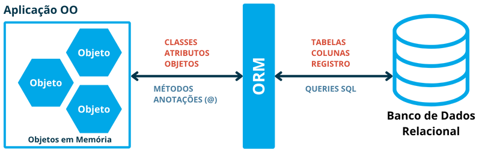
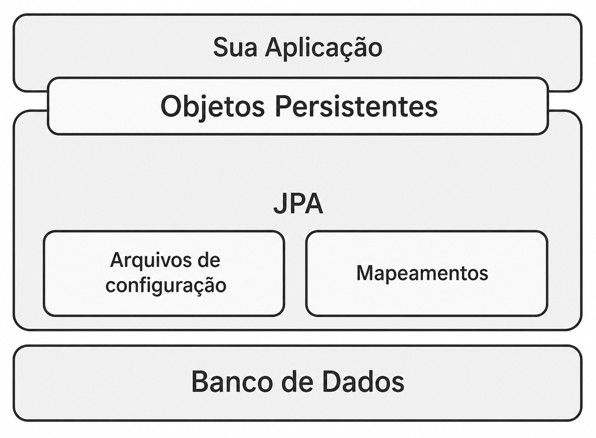
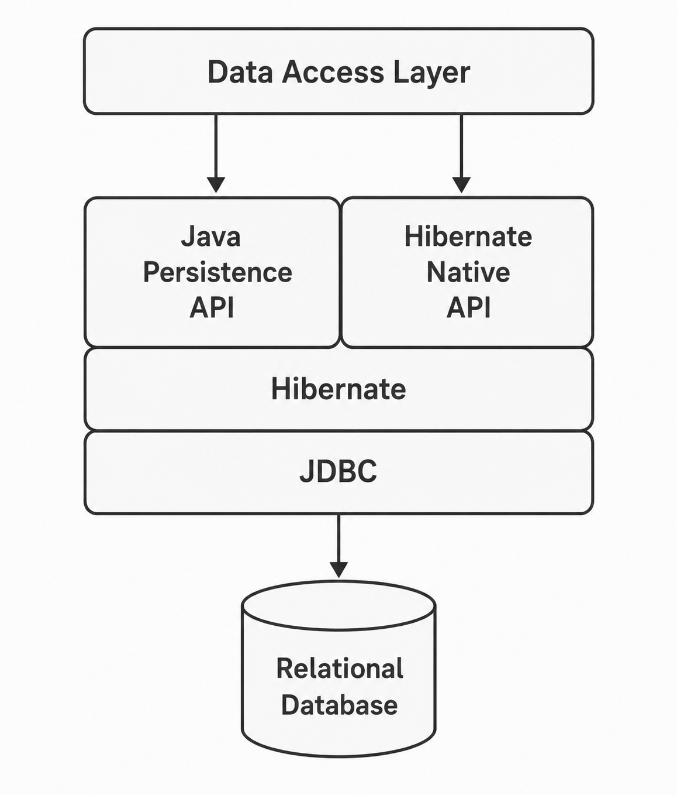
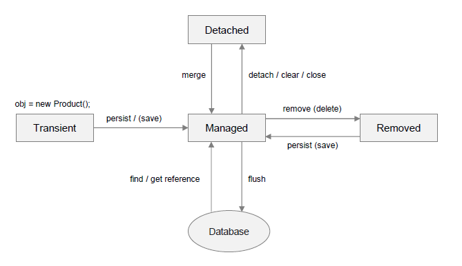
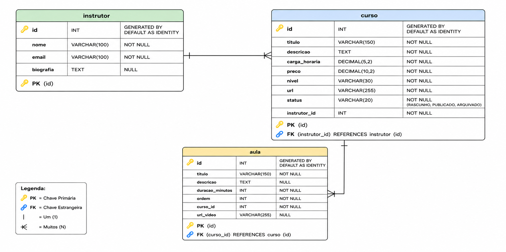

# Parte 1 - Introdução ao ORM, JPA e Hibernate

## 🎯 Objetivos

Ao final deste artigo você deverá ser capaz de:

- Compreender o problema do mapeamento objeto-relacional;
- Entender o conceito de ORM;
- Explicar o papel da JPA no ecossistema Java;
- Diferenciar JPA e Hibernate.

---

## O que você encontrará neste artigo

- [🧠 Revisão: JDBC e DAO](#revisao)
- [🤔 O Problema do Mapeamento Objeto-Relacional](#problema)
- [🔄 O Que é ORM?](#orm)
- [⚙️ JPA e Hibernate](#jpa)
- [📦 Preparando o Ambiente](#preparando-ambiente)

---

<a id="revisao"></a>
## 🧠 Revisão: JDBC e DAO

Antes de avançarmos para ORM, vamos recordar rapidamente como realizávamos persistência utilizando JDBC.

Exemplo de consulta:

```java
String sql =
    "SELECT * FROM seller WHERE id = ?";

PreparedStatement stmt =
    conn.prepareStatement(sql);

stmt.setInt(1, id);

ResultSet rs = stmt.executeQuery();
```

Após executar a consulta precisávamos converter manualmente os resultados:

```java
Seller seller = new Seller();

seller.setId(
    rs.getInt("id")
);

seller.setName(
    rs.getString("name")
);

seller.setEmail(
    rs.getString("email")
);
```

---

### Problemas da Abordagem JDBC

Embora funcional, essa abordagem possui algumas limitações:

**Muito código repetitivo**

Sempre precisamos:

* Abrir conexão;
* Criar comandos SQL;
* Executar consultas;
* Percorrer ResultSets;
* Criar objetos manualmente.

**Forte acoplamento ao SQL**

Uma simples mudança na estrutura da tabela pode exigir modificações em diversos pontos do sistema.

**Conversão Manual**

O programador precisa constantemente converter:

```text
Banco
 ↓
ResultSet
 ↓
Objeto Java
```

e vice-versa.

> **Conclusão:** embora seja importante conhecer JDBC, essa abordagem não é a mais produtiva para aplicações corporativas modernas.

---

<a id="problema"></a>
## 🤔 O Problema do Mapeamento Objeto-Relacional

A maior parte das aplicações backend modernas é desenvolvida utilizando Orientação a Objetos.

Exemplo:

```java
public class Seller {

    private Integer id;

    private String name;

    private Department department;
}
```

Entretanto, bancos relacionais trabalham com tabelas:

```sql
CREATE TABLE seller (
    id SERIAL PRIMARY KEY,
    name VARCHAR(100),
    department_id INTEGER
);
```

Observe que os dois modelos representam o mesmo domínio de formas bem diferentes.

---

### Object-Relational Impedance Mismatch

> **Esse conflito recebe o nome de:**
>
> - Object-Relational Impedance Mismatch ou **Descasamento de Impedância Objeto-Relacional**

As diferentes formas de representar o mesmo domínio gera problemas de conversão entre os dois modelos. Sem uma ferramenta de mapeamento, o programador precisa escrever muito código repetitivo para realizar essa conversão (como vimos usando JDBC puro).

### Diferenças Entre os Modelos

| Orientação a Objetos | Banco Relacional              |
| -------------------- | ----------------------------- |
| Classe               | Tabela                        |
| Objeto               | Registro                      |
| Atributo             | Coluna                        |
| Associação           | Chave Estrangeira             |
| Herança              | Não possui equivalente direto |
| Coleções             | Tabelas relacionadas          |

---

### Exemplo

Orientação a Objetos:

```java
seller.getDepartment()
      .getName();
```

Banco Relacional:

```sql
SELECT d.name
FROM seller s
INNER JOIN department d
ON d.id = s.department_id
```

Mesma informação, mas com representações diferentes.

---

<a id="orm"></a>
## 🔄 O Que é ORM?

📌 ORM significa: ***Object Relational Mapping*** ou _**Mapeamento Objeto-Relacional**_.

É uma técnica que permite mapear automaticamente:

| Orientação a Objetos | Modelo Relacional |
| -------------------- | ----------------- |
| Classe               | Tabela            |
| Objeto               | Linha             |
| Atributo             | Coluna            |
| Associação           | FK                |

Além disso, o ORM permite que o desenvolvedor trabalhe com objetos, sem precisar escrever SQL manualmente, enquanto os mantém em um contexto de persistência, gerenciado pela ferramenta de ORM.



A ténica de ORM faz o ***"meio de campo"*** entre os dois modelos, permitindo que o desenvolvedor trabalhe com objetos Java, enquanto a ferramenta de ORM cuida da conversão para SQL e da persistência no banco de dados.

### Objetivo do ORM

O desenvolvedor deve ser capaz de trabalhar com objetos Java, sem precisar se preocupar com a conversão para SQL. 

Em um relacionamento entre as entidades `Seller` e `Department`, por exemplo, o desenvolvedor deve ser capaz de escrever:

```java
seller.getDepartment();
```

em vez de:

```sql
SELECT *
FROM seller
INNER JOIN department ...
```

### Benefícios

* Menos código repetitivo;
* Maior produtividade;
* Menor acoplamento;
* Melhor integração com OO;
* Portabilidade entre bancos.

### Outros problemas que o ORM resolve

- **Contexto de persistência:** O ORM mantém os objetos em um contexto de persistência, permitindo que o desenvolvedor trabalhe com eles sem se preocupar com a sincronização com o banco de dados.
- **Cache de objetos:** O ORM pode armazenar objetos em memória, reduzindo a necessidade de acessar o banco de dados repetidamente.
- **Gerenciamento de transações:** O ORM facilita o gerenciamento de transações, garantindo a integridade dos dados.
- **Lazy Loading:** O ORM pode carregar objetos somente quando necessário, melhorando o desempenho da aplicação.

### Limitações

ORM não elimina a necessidade de conhecer:

* SQL;
* Modelagem Relacional;
* Índices;
* Performance.

---

<a id="jpa"></a>
## ⚙️ JPA e Hibernate

Cada lingua de programação possui suas próprias ferramentas de ORM. Em Python, por exemplo, uma das ferramentas de ORM mais popular é o **SQLAlchemy**. No ecossistema .NET, a ferramenta de ORM mais popular é o **Entity Framework**. No PHP, com o framework Laravel, a ferramenta de ORM mais popular é o **Eloquent**. Desenvolvedores da plataforma Node.js podem utilizar o **Sequelize**, **Prisma**, entre outras, como ferramentas de ORM.

No ecossistema Java, temos uma especificação padrão de ORM chamada **JPA (Jakarta Persistence API)**, que define como a persistência de dados deve ser realizada em aplicações Java. Com base nessa especificação, existem diversas implementações de ORM, sendo a mais popular o **Hibernate**.

### O Que é JPA?

📌 JPA significa: ***Jakarta Persistence API***

A JPA é uma **especificação** padrão da plataforma Jakarta EE (antiga Java EE) que define como a persistência de dados e ORM devem ser realizados em aplicações Java.

A JPA é apenas uma especificação e pode ser consultada na íntegra em: [https://jakarta.ee/specifications/persistence/](https://jakarta.ee/specifications/persistence/). Ela define:
- Interfaces;
- Contratos;
- Regras;
- Anotações.

A arquitetura de uma aplicação que utiliza JPA é composta por três camadas:



- **Aplicação Java:** onde o desenvolvedor escreve o código da aplicação, com suas classes de domínio, regras de negócio e lógica de apresentação;
- **Camada JPA:** com suas interfaces, contratos e anotações, que definem como a persistência de dados deve ser realizada, utilizando uma implementação de ORM;
- **Banco de Dados:** onde os dados são armazenados e recuperados, utilizando SQL.

As classes de domínio da aplicação são mapeadas para tabelas do banco de dados, sendo chamadas de **entidades**, e os objetos Java do domínio são gerenciados pela camada JPA, chamados então de **objetos persistentes**.

### O que é Hibernate?

Como aprendemos, a JPA não executa nada sozinha. Para que a persistência funcione, precisamos de uma implementação da especificação. 

A implementação mais popular da JPA é o **Hibernate**, que é um framework de ORM para Java, que implementa a especificação JPA e adiciona funcionalidades adicionais, como cache de segundo nível, suporte a consultas nativas, entre outras.

Você pode consultar a documentação do Hibernate em: [https://hibernate.org/orm/](https://hibernate.org/orm/). Aqui vamos nos concentrar na compreensão da especificação JPA e desenvolver nossos exemplos com base nela, utilizando o Hibernate como implementação.

### JPA x Hibernate

| JPA              | Hibernate            |
| ---------------- | -------------------- |
| Especificação    | Implementação        |
| Define contratos | Executa os contratos |
| Padroniza APIs   | Implementa APIs      |

### Arquitetura de uma aplicação JPA com Hibernate

Uma aplicação JPA com Hibernate utiliza a arquitetura de três camadas, onde a camada JPA é implementada pelo Hibernate. A aplicação Java interage com a camada JPA, que por sua vez interage com o banco de dados, utilizando JDBC para executar as operações de persistência.

O Hibernate também disponibiliza uma API própria, que pode ser utilizada diretamente, sem passar pela camada JPA. No entanto, é recomendável utilizar a API JPA, pois ela é padronizada e permite a portabilidade entre diferentes implementações de ORM.



> ✨ Observe que o Hibernate continua utilizando JDBC internamente.

### Principais Componentes da JPA

Os principais conceitos e componentes da JPA são:

**Entity**

- Representa uma tabela do banco de dados, mapeada para uma classe de domínio em Java.
- Contém atributos que representam as colunas da tabela, e métodos que representam as operações de persistência.

**EntityManager**

- Gerencia o ciclo de vida das entidades, permitindo que sejam persistidas, atualizadas, removidas e consultadas no banco de dados.
- De forma superficial, podemos dizer que o `EntityManager` corresponde ao objeto `Connection` do JDBC, mas com funcionalidades adicionais, como o gerenciamento do **contexto de persistência**.
- Geralmente temos uma instância de `EntityManager` por transação/requisição.

**EntityManagerFactory**

- Cria instâncias de `EntityManager`, que são utilizadas para interagir com o banco de dados.
- Geralmente temos uma única instância de `EntityManagerFactory` por aplicação, que é criada no início da aplicação e destruída no final.

**Contexto de Persistência**

- É um cache de objetos persistentes, que mantém os objetos em memória enquanto a transação está ativa.
- Permite que o desenvolvedor trabalhe com os objetos sem se preocupar com a sincronização com o banco de dados.
- É gerenciado através do `EntityManager`, que mantém os objetos em memória enquanto a transação está ativa, e sincroniza com o banco de dados quando a transação é finalizada.

**Estados das Entidades**

As entidades mapeadas podem estar em quatro estados diferentes:



- **Transient:** a entidade foi criada, mas ainda não foi persistida no banco de dados. Ela não possui um identificador (ID) e não está associada a um contexto de persistência.

    ```java
    Seller seller = new Seller();
    seller.setName("John Doe");
    // seller está no estado Transient
    ```
- **Managed:** a entidade está associada a um contexto de persistência e possui um identificador (ID). Ela pode ser persistida, atualizada ou removida do banco de dados.

    ```java
    EntityManager em = entityManagerFactory.createEntityManager();
    em.getTransaction().begin(); // Iniciando a transação
    // seller está no estado Managed
    Seller seller = em.find(Seller.class, 1); // Recuperando a entidade do banco de dados com ID 1

    seller.setName("Jane Doe"); // Atualizando o nome da entidade
    em.getTransaction().commit(); // Finalizando a transação
    ```
    - No exemplo acima, a entidade `seller` está no estado Managed enquanto a transação está ativa. 
    - Quando a transação é finalizada, o estado da entidade é sincronizado com o banco de dados. 
    - Como executamos uma atualização no nome da entidade, o Hibernate irá gerar um comando SQL `UPDATE` para atualizar o registro correspondente no banco de dados.

- **Detached:** a entidade foi persistida no banco de dados, mas não está mais associada a um contexto de persistência. Ela possui um identificador (ID), mas não pode ser atualizada ou removida do banco de dados.

    ```java
    EntityManager em = entityManagerFactory.createEntityManager();
    em.getTransaction().begin(); // Iniciando a transação
    Seller seller = em.find(Seller.class, 1);
    em.getTransaction().commit(); // Finalizando a transação
    // seller está no estado Detached
    seller.setName("John Smith"); // Atualizando o nome da entidade
    ```
    - No exemplo acima, a entidade `seller` está no estado Detached após a transação ser finalizada.
    - A instrução `seller.setName("John Smith");` não irá gerar um comando SQL `UPDATE`, pois a entidade não está mais associada a um contexto de persistência.

- **Removed:** a entidade foi marcada para remoção do banco de dados, mas ainda não foi removida. Ela está associada a um contexto de persistência e possui um identificador (ID).

    ```java
    EntityManager em = entityManagerFactory.createEntityManager();
    em.getTransaction().begin(); // Iniciando a transação
    Seller seller = em.find(Seller.class, 1);
    em.remove(seller); // Marcando a entidade para remoção
    em.getTransaction().commit(); // Finalizando a transação
    ```
    - No exemplo acima, a entidade `seller` está no estado Removed após a instrução `em.remove(seller);`.
    - Quando a transação é finalizada, o Hibernate irá gerar um comando SQL `DELETE` para remover o registro correspondente no banco de dados.

---

<a id="preparando-ambiente"></a>
## 📦 Preparando o Ambiente

Após essa introdução teórica, vamos preparar o ambiente para a primeira prática de ORM com JPA e Hibernate.

Nesta prática utilizaremos:

- Maven
- PostgreSQL
- Hibernate ORM
- Jakarta Persistence API

**Contexto e Modelo de Dados**

Para as práticas desenvolvidas nesta série de artigos, utilizaremos como exemplo, o domínio de uma plataforma de cursos online, inicialmente com as entidades `instrutor`, `curso` e `aula`. Observe o diagrama ER abaixo, que representa o modelo de dados da aplicação:



- **Relacionamento entre as entidades:**
  - ***relacionamento 1:N entre `instrutor` e `curso`:*** Um instrutor pode ministrar vários cursos, enquanto um curso é ministrado por apenas um instrutor;
  - ***relacionamento 1:N entre `curso` e `aula`:*** Um curso pode ter várias aulas, enquanto uma aula pertence a apenas um curso.

### Criando o Banco

1. Abra sua instância do `pgAdmin` e crie um banco chamado `anuncios_jpa`.

2. Você poderia criar as tabelas manualmente, mas vamos deixar que o Hibernate faça isso para nós. Na próxima parte, quando criarmos as entidades JPA em nossa aplicação, o Hibernate irá gerar automaticamente as tabelas no banco de dados.

### Estrutura Inicial do Projeto

1. No VS Code, crie um novo projeto Maven vazio (sem `archetype`).

2. Em `groupId` utilize `com.seunome` e em  `artifactId` utilize `anuncios_jpa`.

Estrutura esperada:

```text
anuncios_jpa

├── pom.xml
|
└── src
    ├── main
    |    ├── java/com/seunome
    |    |              ├── Main.java
    |    └── resources
    └── test
```

3. Crie os seguintes pacotes dentro do seu pacote base:

```text
src/main/java/com/seunome

├── entities
└── util
```

Onde:

- **entities:** Entidades JPA (`Instrutor`, `Curso` e `Aula`).
- **util:** Classes de configuração, como `PersistenceUtil`, que terá a responsabilidade de criar e gerenciar a `EntityManagerFactory`.

4. No arquivo `pom.xml` adicione as dependências do Hibernate e da JPA, além do driver JDBC do PostgreSQL.

```xml
<dependencies>
    <dependency>
        <groupId>org.hibernate.orm</groupId>
        <artifactId>hibernate-core</artifactId>
        <version>7.4.2.Final</version>
    </dependency>

    <dependency>
        <groupId>jakarta.persistence</groupId>
        <artifactId>jakarta.persistence-api</artifactId>
        <version>3.2.0</version>
    </dependency>

    <dependency>
        <groupId>org.postgresql</groupId>
        <artifactId>postgresql</artifactId>
        <version>42.7.11</version>
    </dependency>
</dependencies>
```

5. Ainda no arquivo `pom.xml`, verifique a versão do Java utilizada no projeto. Nessa série de artigos, vou utilizar o Java 21:

```xml
<properties>
    <maven.compiler.source>21</maven.compiler.source>
    <maven.compiler.target>21</maven.compiler.target>
</properties>
```

---

Na próxima parte construiremos o projeto completo, incluindo:

* Configuração detalhada do `persistence.xml`;
* Criação das entidades `Instrutor`, `Curso` e `Aula` com seus respectivos atributos e relacionamentos;
* Explicação aprofundada das anotações de mapeamento `@Entity`, `@Table`, `@Id`, `@GeneratedValue`, `@ManyToOne`, `@JoinColumn`;
* Implementação completa das classes de domínio;
* Primeira execução do Hibernate gerando SQL automaticamente.
