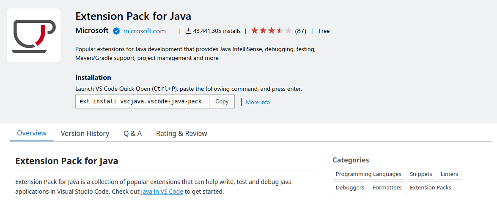
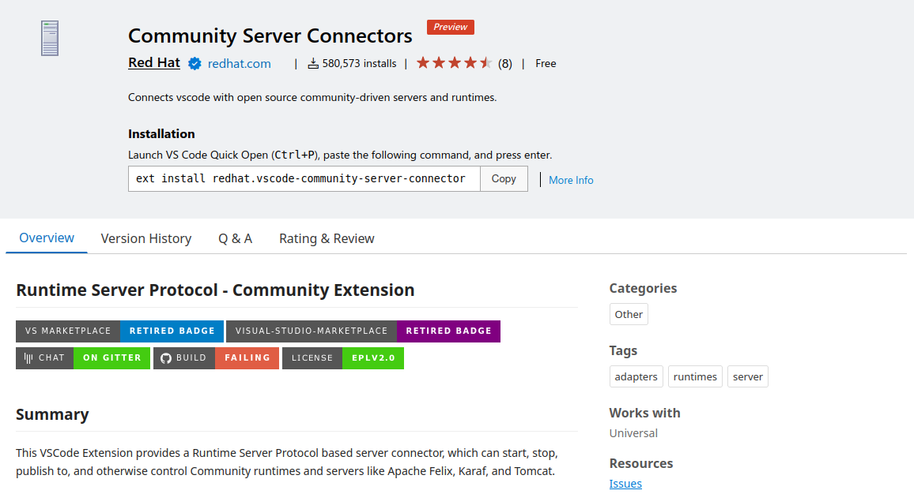
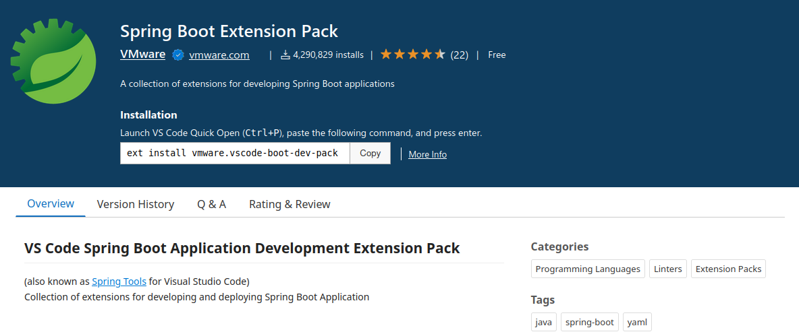
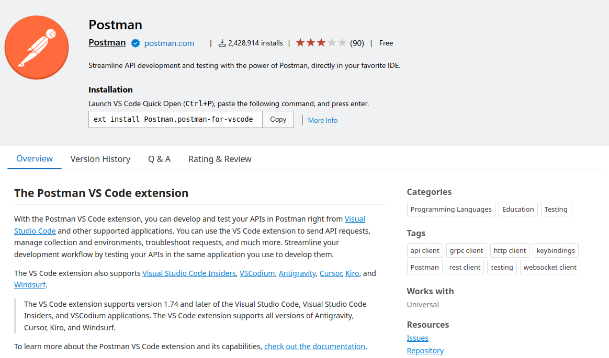

# Ferramentas e Configurações - Programação Web I

> ▶️ As seções abaixo trazem os links e as instruções de download e instalação das ferramentas necessárias para o desenvolvimnto das práticas da nossa disciplina de Programação Web I, curso de Análise e Desenvolvimento de Sistemas do IFCE - Campus Tauá.

## 1. Java JDK

Antes de prosseguir para as próximas seções deste documento, certifique-se de que você já tenha o _Java Development Kit (JDK)_ devidamente instalado e configurado. Caso ainda não o tenha, sugiro que siga esse tutorial para realizar a instalação e a configuração de acordo com o seu sistema operacional: https://www3.ntu.edu.sg/home/ehchua/programming/howto/JDK_HowTo.html.

> 📌 O JDK já está instalado e configurado adequadamente nos computadores dos laboratórios do campus.

## 2. Extensões do VS Code

Vamos utilizar o Visual Studio Code para nossas práticas e, dessa forma, é importante saber quais extensões serão úteis nessa jornada.

- _Extension Pack for Java_: https://marketplace.visualstudio.com/items?itemName=vscjava.vscode-java-pack

    > Esse pacote de extensões é essencial para trabalhar com qualquer projeto em Java a partir do VS Code. Ele traz as seguintes extensões: _Language Support for Java™ by Red Hat_, _Debugger for Java_, _Test Runner for Java_, _Maven for Java_, _Gradle for Java_ e _Project Manager for Java_.

    

- _Community Server Connectors_: https://marketplace.visualstudio.com/items?itemName=redhat.vscode-community-server-connector

    > Essa extensão irá facilitar o processo de conexão e gerenciacmento de servidores e runtimes para aplicações Java.

    

- _Spring Boot Extension Pack_: https://marketplace.visualstudio.com/items?itemName=vmware.vscode-boot-dev-pack

    > Esse pacote traz as seguintes extensões para projetos construídos com Spring Boot: _Spring Boot Tools_, _Spring Initializr Java_, _Spring Boot Dashboard_.

     

- _Postman_: https://marketplace.visualstudio.com/items?itemName=Postman.postman-for-vscode

    > O Postman é uma ferramenta popular para ajudar a desenvolver e testar APIs, O VS Code possui uma extensão oficial para integrar esta ferramenta diretamente no editor de código. Será necessário criar uma conta para utilizar o Postman, mas é um processo rápido e sem nenhuma dificuldade.

    

## 3. Apache Maven

O **[Apache Maven](https://maven.apache.org)** é um gerenciador de projetos Java muito popular, além de trazer diversos recursos de build e empacotamento da aplicação.

Em nossas práticas, vamos utilizar a **versão 3.9.15**, que é a versão mais recente no momento da elaboração deste documento.

**Link de download:** https://maven.apache.org/download.cgi

### Instalação Manual

Para instalar o Apache Maven nos computadores dos laboratórios, iremos seguir um processo de instalação manual.

1. Baixe o arquivo `apache-maven-3.9.15-bin.tar.gz` no link acima.
2. Extraia a pasta compactada no arquivo acima. Você pode extrair:
    - pela interface gráfica: Duplo clique no arquivo compactado > Extrair > Selecione o local (pode ser na pasta pessoal); ou
    - pelo terminal aberto na pasta onde você realizou o download do arquivo, com o seguinte comando: `tar xzvf apache-maven-3.9.15-bin.tar.gz`; depois mova a pasta descompactada para a pasta pessoal ou outra localização que preferir.

> Está feita a instalação!

### Instalando de Outras Maneiras

Se você vai utilizar o seu próprio computado para as práticas, siga as instruções específicas para seu sistema operacional em: https://maven.apache.org/install.html.

### Configurando a Extensão Maven

Agora, para garantir que a extensão **_Maven for Java_**, instalada no pacote _Extension Pack for Java_, consiga executar os comandos maven adequadamente, faremos o seguinte:

1. Busque pela extensão _Maven for Java_ na busca de extensões do VS Code.
2. Acesse as configurações da extensão (clique no ícone de engrenagem e selecione _"settings"_).
3. Na configuração **Maven > Executable: Path** insira o caminho absoluto do binário **mvn**.
    > Algo como: `/home/aluno/apache-maven-3.9.15/bin/mvn` (troque pela localização correta em seu computador).
4. Reinicie o VS Code.
5. Teste se deu certo, criando um novo projeto Java com Maven.
    - Acesse a paleta de comandos do VS Code (CTRL + SHIFT + P).
    - Comece a digitar _"Java: "_ e selecione _"Java: Create Java Project..."_.
    - Selecione **_Maven_** como _build tool_.
    - Selecione **_maven-archetype-webapp_** como template básico para criação do projeto.
    - Avance até selecionar a pasta de destino do projeto.
    - Se tudo der certo, o projeto será criado e você poderá abrí-lo no VS Code.
    - Caso apresente algum erro no teminal, revise com cuidado se seguiu todos os passos e tente novamente.

---

## 4. Apache Tomcat

O **[Apache Tomcat](https://tomcat.apache.org)** é uma implementação _open source_ de grande parte das especificações **[Jakarta EE, antigo Java EE](https://jakarta.ee/)**. O Tomcat atua como um servidor web de aplicações desenvolvidas em Java, além de ser o servidor embutido padrão do Spring Boot.

O Apache Tomcat pode ser simplesmente baixado em https://tomcat.apache.org e, assim como o Apache Maven, extraído para alguma pasta do sistema. Porém, vamos sempre trabalhar com ele de forma embutida na IDE. 

Inicialmente vamos usar a extensão _Community Server Connector_ para criar um servidor e realizar o download do Tomcat 11 e iniciá-lo automaticamente. Quando avançarmos na disciplina para utilizar o _Spring Boot_, não iremos precisar realizar nenhuma configuração extra, pois o Tomcat já é o servidor embuitido padrão do Spring Boot e já é iniciado automaticamente quando executamos o nosso projeto.

---

## 5. Próximos Passos

No momento são essas as ferramentas e configurações necessárias. Iremos iniciar as práticas da disciplina abordando uma visão geral do Java, apresentando sua sintaxe, principais pacotes, utilitários e comandos, bem como os principais conceitos e técnicas de Orientação a Objetos.

Na sequência, vamos começar a construir as nossas primeiras aplicações web seguindo as especificações Jakarta EE e Servlets. Por fim, vamos nos aprofundar na criação de aplicações web backend e APIs REST com Spring Boot.

> Nos próximos conteúdos, trarei alguns exemplos práticos de criação de projetos Java no VS Code para testar nosso ambiente configurado através deste material.